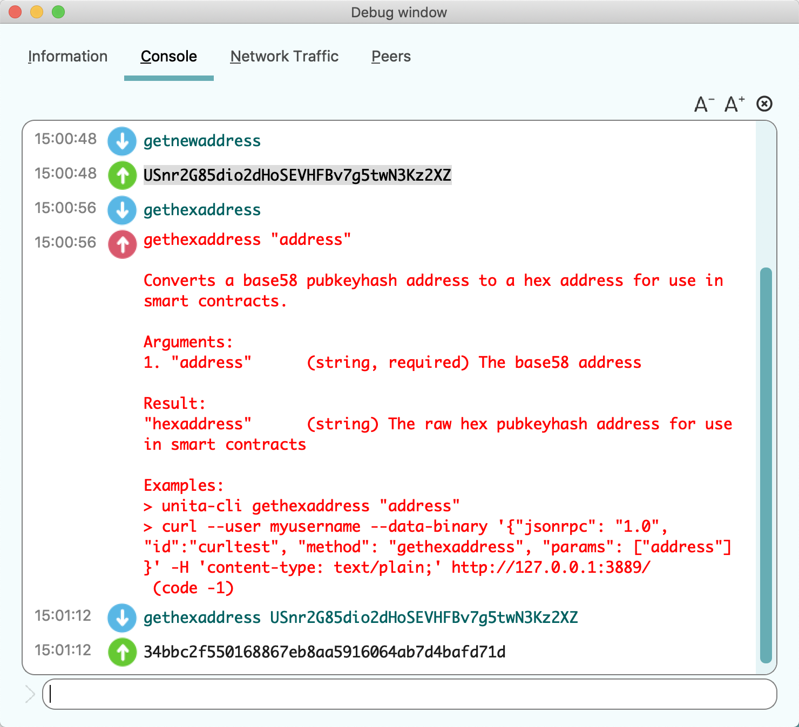
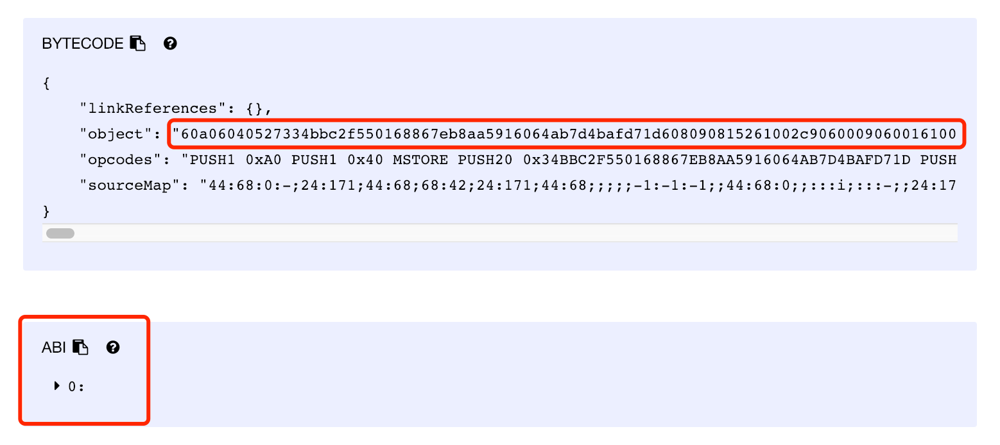
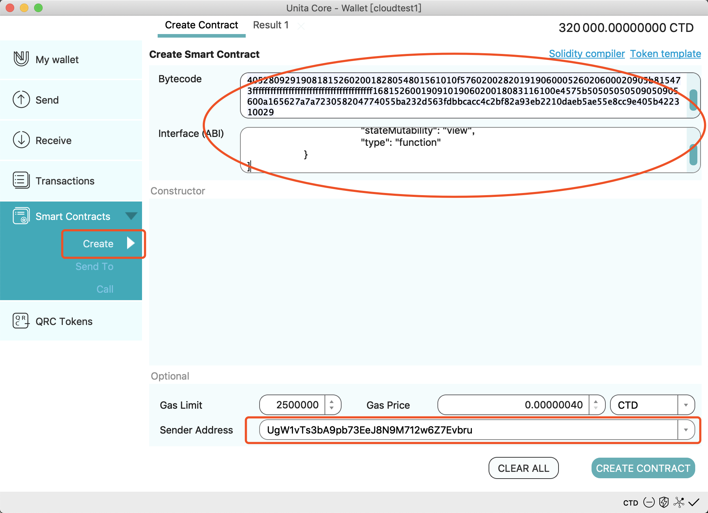
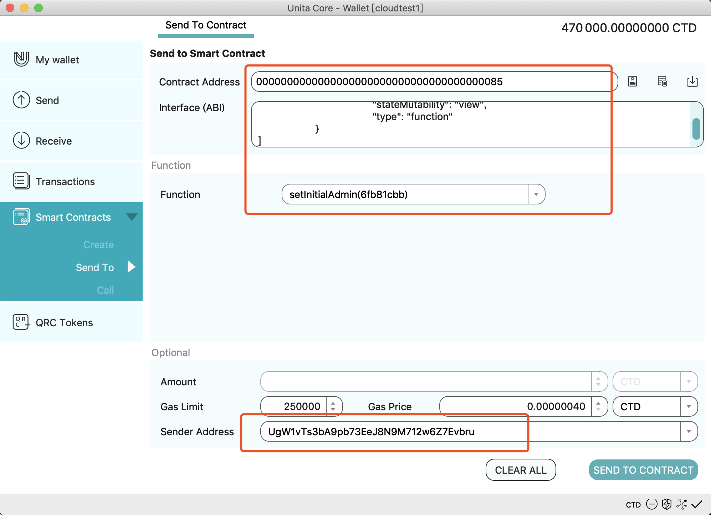
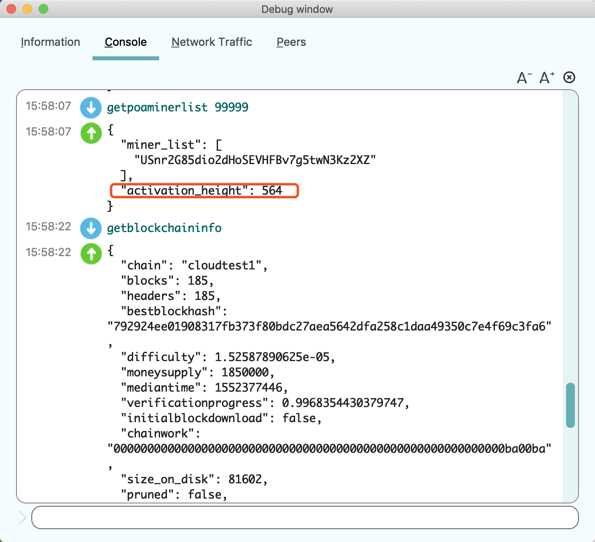
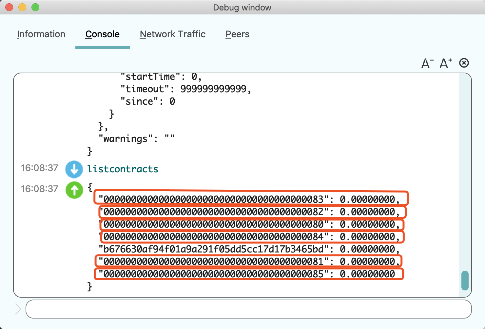

# Unita One-click Blockchain

- [Unita One-click Blockchain](#unita-one-click-blockchain)
- [Download](#download)
- [Sign up and Sign in](#sign-up-and-sign-in)
- [Build Private Chain](#build-private-chain)
  - [Generate Configuration](#generate-configuration)
  - [Start Private Chain](#start-private-chain)
  - [Connect Private Chain](#connect-private-chain)
- [Seed Node](#seed-node)
- [Build Consortium Chain](#build-consortium-chain)
  - [Configuration](#configuration)
  - [Start](#start)
- [Online Governance](#online-governance)
  - [About DGP](#about-dgp)
  - [Modify Miners List](#modify-miners-list)
  - [Modify System Parameters](#modify-system-parameters)

# Download
Download the Unita full node wallet from the [latest installation package](https://github.com/UnitaNetwork/unita/releases) on GitHub and install it to any directory.

# Sign up and Sign in
1. Run unitad (server wallet) or unita-qt (desktop GUI wallet) to start the Unita main chain.
2. To enter commands to the wallet open the Help - Debug window - Console for the QT wallet or use unita-cli (command line interface) to issue RPC commands to the unitad wallet.
3. Execute the `getnewaddress` command to generate a new Unita address, and copy to a text file.
4. Execute the `dumpprivkey` command to get the private key of the new address, and copy to a text file.
5. Open the Unita [One-click blockchain](https://chain.unita.network/) website, click LOGIN to enter the login page. Copy the 32-character hex message at the top of the login form ("Sign the following message to verify your address") to a text file.
6. Execute the `signmessage` command using the new Unita address to sign the 32-character hex message from the login page, and copy the resulting signature to the "Signed Message" field of the login page, along with the new Unita address to the "Address" field. You can also login with the Unita address and the (WIF) private key.
7. Click LOGIN to complete the login.


# Build Private Chain
In order to make it easier to understand the Unita platform, we will first introduce how to build your own private chain.

## Generate Configuration
On the One-click blockchain website (logged in as above) click "LAUNCH A NEW CHAIN", enter the page of release new chain. After filling in all the information of the new chain, click SUBMIT to release the new chain. The meaning of each field is as follows.
1. Chain id: the name of the chain, only supports lowercase letters and numbers, must be unique. Such as "mychain123".
2. Token name: the name of the coin, only supports capital letters and numbers, must be unique. Such as BTC or UNT.
3. Description: the description of the chain, to introduce the chain, also used to generate the genesis block. Such as "my first blockchain".
4. Message Header: Network header packet, used to distinguish different chains in network transmission, must be unique. 4-byte length with eight hexadecimal characters using 0 - 9 and a - f, such as "1234fedc".
5. Algorithm: Consensus algorithm, only PoA (Proof of Authority) consensus is currently supported, more choices will be provided in the future. For more about PoA, reference [SCAR](https://doc.unita.network/en/SCAR-Consensus/).
6. Miner list: the list of PoA miners, one or more addresses, separated by commas. When we build the first private chain, use the default login address.
7. Block interval: the normal block spacing, you can use the default value.
8. Timeout: Timing to skip to the next miner (see the SCAR documentation), you can use the default value.
9. Default port: The default port address, a decimal number in the range 1024 - 65535.
10. RPC port: The RPC port address, a decimal number in the range 1024 - 65535.
11. Dns seed & Ip seed: The default connection seed node in the network when a new node joins. Because it is a private chain, left empty here.
12. Init Reward: Initial rewards for each block in the first halving interval.
13. Halving interval: The number of blocks in each halving interval. The reward drops by half after this number of blocks.
14. Halving times: The number of halvings before the block reward is set to zero.

## Start Private Chain
We create a chain named "xunita" ([Link](https://chain.unita.network/#/chain/view?chainId=xunita)), with following steps:
1. Launch the unitad wallet on the command line with `unitad -chain=xunita` or with the unita-qt wallet select Settings - Options and enter "xunita" in the Unita chain id field.

2. Use the `getpoaminerlist` command to see the list of miners.
3. Use the `importprivkey` command to import a new miner's private key.
4. Use the `setpoaminer` command to add a new miner's address, then restart the wallet (node) to add this miner. You can switch between PoA and SCAR consensus with the optional mode parameter of the setpoaminer command([SCAR consensus algorithm](https://doc.unita.network/en/SCAR-Consensus/)).
```
setpoaminer "address" "greedy" or null  // adopt PoA consensus algorithm
setpoaminer "address" "scar"            // adopt SCAR consensus algorithm
```


5. We can see that the number of blocks is increasing from the QT My Wallet page or using the `getblockchaininfo` command.


6. With your Unita chain startup success you can try sending coins or publishing smart contracts！

## Connect Private Chain
Assuming that we have started the private chain "xunita" on the machine A with mining, then we can start the node on the machine B to access the private chain.
1. On machine B launch the unitad node (`unitad -chain=xunita`) or launch the unita-qt wallet and with Settings - Options enter "xunita" in the chain id field.
2. Use the addnode commmand `addnode "IP_A" add` to add a peer connection to the IP address of the node on machine A.
3. After connecting we can view the node status with the `getpeerinfo` command.
4. Try to send a coin transaction between the two nodes.


# Seed Node
A new node joining the block chain can quickly find the network by connecting to the seed node (seed) at the time of startup, using the address saved from machine A above. The seed node can be an IP address or a domain name, providing there are nodes running on the IP addresses used. The following steps explain the process of configuring the seed node.
1. Build a new chain named "xxxxx" ([Link](https://chain.unita.network/#/chain/view?chainId=xxxxx)), in the Seed Node fields, fill in a domain name Dns seed, or fill in server address in Ip seed. If you use the domain name, please parse the domain name to your server.

```
Dns seed:  beta.unita.network
Ip seed:   47.88.61.227
```
2. On the server with address 47.88.61.227, use `./unitad -chain=xxxxx` to start the node.

```
root@47.88.61.227:./unitad -chain=xxxxx -daemon
```

3. The configuration is complete, any new node starting on the "xxxxx" chain will connect to the seed node to make a peer connection. You can see the nodes connected with the `getpeerinfo` command.


# Build Consortium Chain
The difference between a consortium chain and a private chain is that the consortium chain is maintained by many miners. EOS is a typical consortium chain: first we select multiple super nodes through voting governance, then these super nodes are responsible for producing the blocks and get the block rewards.

## Configuration
Build a new consortium chain named "unitax" （[Link](https://chain.unita.network/#/chain/view?chainId=unitax)). Compared to private chains, the main change is that the miner list field has 3 miners' addresses, separated by commas:
```
Miner list
UgW1vTs3bA9pb73EeJ8N9M712w6Z7Evbru,Um8w24duUhf1XE8NVcbzn91tCeiuRWU188,UjBnjZ39N7U3vRkKoknntkkfiKzFbphZRR
```

## Start
Start 3 nodes connecting to the seed server, and begin mining by using the `importprivkey` and `setpoaminer` commands. We can see that the height of blocks is increasing and the system is running normally using the `getblockchaininfo` command. We can see the miner of every block using the `getblock` command:


# Online Governance
## About DGP
DGP (Decentralized Governance Protocol) is a technology firstly applied in Qtum. It allows modification of the parameters of the blockchain online by use of smart contracts without the need for soft or hard forks.

The way DGP works is very straightforward. First, an administrator of DGP initiates a proposal to change a certain system parameter. Subsequently, all DGP administrators can vote on this proposal. If the proposal receives enough approval votes, the parameter modifications in the proposal will take effect. Then, the proposed parameters will be stored in the blockchain, which is convenient for the blockchain software to obtain.

Obviously, DGP is suitable for storing and updating a list of authorized miners in a PoA. Authorized miners can be considered as a list of public keys which has been initialized through a configuration file and then updated via DGP. We need to make some changes to DGP to make the miner's update process more secure.

The list of miners updated by DGP needs to be delayed by at least n/2+1 blocks.

Here, n is length of list before update, and n/2 is integer division. This mechanism ensures that the update of miners list will not take effect until it becomes a permanent record on blockchain. Otherwise, if the update operation can be negated by another fork, miners in list before it has been updated are likely to continue mining under this fork which may even lead to hard fork.

## Modify Miners List
DGP contract of miners list is deployed at the address "0000000000000000000000000000000000000085", the source code of which can be found on GitHub: [dgp-template.sol.js](https://github.com/qtumproject/qtum-dgp/blob/master/dgp-template.sol.js). The minerList-dgp.sol for miners list is as follows:

```
pragma solidity ^0.4.8;

contract minerList{
        address[] _minerList=[
	0x47210a1bacc15175bb24c3384e5d3650991a7bc4,
	0xfe6e43ffb52ef746a0db8cc51cb95921c34ca0a3,
	0x6cadd7aefdb363ae680fc234dcfe4c40919781d3
        ];

        function getMinerList() constant returns(address[] vals){
	        return _minerList;
        }
}
```

The process of updating miners can be briefly described as follows:

1. Determine address of each miner, then use the `gethexaddress` command to get the corresponding hexaddress.



2. Fill all miners' hexaddress into the minerList parameter in minerList-dgp.sol to get a new miner list.


3. Compile and generate the binary code of minerList-dgp.sol, copy and fill it in the position below in the Unita wallet.





4. Get the deployed contract address "minerListAddress", then call the setInitialAdmin() and addAddressProposal(minerListAddress, 2) functions in dgp-template.sol to vote on the new minerListAddress.




5. New minerListAddress passes after receiving enough votes. It will be recorded into the paramsHistory parameter and take effect after several blocks (currently 500). The execution of the getpoaminerlist is shown below.



## Modify System Parameters
First execute the `listcontracts` command to see which contracts are currently on blockchain.



Among them, 80-85 are DGP contracts that are used for online governance of gas_schedule, block_size, gas_price, reservation, block_gas_limit, and miner_list parameters respectively. Specific methods can refer to the method of updating the miner in the previous section.

Notice: Make sure to call the setInitialAdmin() function in DGP contract before modifying parameters.

You can use the `createcontract` command to create a new contract, `callcontract` to call functions in the contract to get results, and `sendtocontract` to send coins and data to contracts. For more contract operations, please see: [Unita Smart Contract Usage and Description](http://docs.qtum.site/en/Qtum-Contract-Usage.html).
