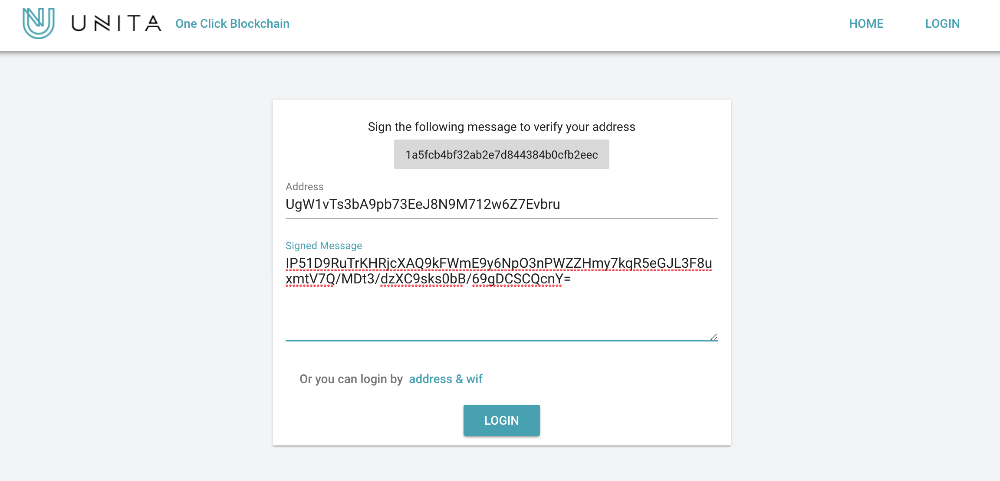

# Unita One-click Blockchain

- [Unita One-click Blockchain](#unita-one-click-blockchain)
- [Download](#download)
- [Sign up and Sign in](#sign-up-and-sign-in)
- [Build Private Chain](#build-private-chain)
  - [Generate Configuration](#generate-configuration)
  - [Start Private Chain](#start-private-chain)
  - [Connect Private Chain](#connect-private-chain)
- [Seed Node](#seed-node)
- [Build Consortium Chain](#build-consortium-chain)
  - [Configuration](#configuration)
  - [Start](#start)
- [Online Governance](#online-governance)
  - [About DGP](#about-dgp)
  - [Modify Miners List](#modify-miners-list)
  - [Modify System Parameters](#modify-system-parameters)

# Download
Download the latest installation package from [Github](https://github.com/zsrem/unitaprerelease/releases) and install it to any directory.

# Sign up and Sign in
1. Run unitad or unita-qt to start the main chain of Unita.
2. Open the Help - Debug window - Console of QT wallet or execute the RPC command by unita-cli.
3. Execute the getnewaddress command, generate a new address as an account and record it.
4. Execute the dumpprivkey command, get the private key of the new address, and record it.
5. Open the Unita [One-click blockchain](https://chain.unita.network/), click LOGIN to enter the login page.
6. Execute the signmessage command, use the generated address to sign the message in the login page, and fill in the login page with the result of signature.
7. Click LOGIN to complete the login.



# Build Private Chain
In order to make it easier to understand, we will first introduce how to build own private chain.

## Generate Configuration
Click LAUNCH A NEW CHAIN，enter the page of release new chain.After filling in all the information of the new chain,click SUBMIT to release the new chain.The meaning of each field is as follows.
1. Chain id:the name of the chain,only support lowercase letters and numbers,unique.Such as mychain123.
2. Token name:the name of the token,only support capital letters and numbers,unique.Such as BTC、UNT.
3. Description:the description of the chain,to introduce the chain,also used to generate genesis block.Such as:my first blockchain.
4. Message Header:Network head packet,used to distinguish different chains in network transmission.4 byte length,sixteen decimal representation,8 0-9a-f characters,such as:1234fedc.
5. Algorithm:Consensus algorithm.Only PoA consensus is supported now,more choices will be provided in the future.Want to know more about PoA,reference [SCAR](https://doc.unita.network/en/SCAR-Consensus/).
6. Miner list:the list of PoA miners,one or more address,separated by commas.When we build the first private chain,use the default account.
7. Block interval、Timeout:See the SCAR docs, you can use the default value directly.
8. Default port:The default port address.
9. Dns seed、Ip seed:The default connection seed node in the network when new node join.Because it is a private chain,left empty here.
10. Init Reward:Initial rewards for each block.
11. Halving interval:The reward will be half after several blocks.
12. Halving times:Times of half.

## Start Private Chain
We create a chain named xunita ([Link](https://chain.unita.network/#/chain/view?chainId=xunita)) ,the chain by the following steps.
1. Use unitad -chain=xunita or After the configuration and restart in unita-qt as shown in the following figure,start the chain named xunita.

2. Execute getpoaminerlist,see the list of miners.
3. Execute importprivkey,import the miner's private key.
4. Execute setpoaminer,use miner's account to mine.It needs to run this command to mine after node restarts.

5. We can see that the number of block is increasing from the QT purse or execute getblockchaininfo command.

6. New chain startup success,try trading or intelligent contracts！

## Connect Private Chain
Assuming that we have started the private chain xunita on the machine A and mine,then we need to start the node on the machine B and access the private chain.
1. Execute unitad -chain=xunita or do configuration to start node of xunita in unita-qt on machine B.
2. Execute addnode "ip_A" add,connect the node on machine A.
3. After connecting, we can view the node situation through the getpeerinfo command.
4. Try to trade with each other between the two nodes.


# Seed Node
The new node of the block chain can quickly find the network by connecting the seed node (seed) at the time of startup,save the steps of addnode at the above text.The seed node can be a IP or a domain name,and there are nodes running on the corresponding servers. The following explains the process of configuring the seed node.
1. Build a new chain named xxxxx ([Link](https://chain.unita.network/#/chain/view?chainId=xxxxx)) ,fill in own domain name in Dns seed,or fill in server address in Ip seed.If you use the domain name,please parse the domain name to your server.

```
Dns seed:  beta.unita.network
Ip seed:   47.88.61.227
```
2. Enter server（47.88.61.227）,use ./unitad -chain=xxxxx to start the node.
```
root@47.88.61.227:./unitad -chain=xxxxx -daemon
```
3. Configuration is completed,any machine starting the xxxxx chain will connect to the seed node to get data.You can see the nodes on the connection through the getpeerinfo command.


# Build Consortium Chain
The difference between consortium chain and private chain is that the consortium chain is maintained by many miners.EOS is a typical consortium chain:first we get multiple super nodes through the campaign,then these super nodes are responsible for producing the blocks and get the reward of the blocks.

## Configuration
Build a new consortium chain named unitax（[Link](https://chain.unita.network/#/chain/view?chainId=unitax)) .Compared to private chain,the main change is that the miner list field has 3 miners' addresses, separated by commas.
```
Miner list
UgW1vTs3bA9pb73EeJ8N9M712w6Z7Evbru,Um8w24duUhf1XE8NVcbzn91tCeiuRWU188,UjBnjZ39N7U3vRkKoknntkkfiKzFbphZRR
```

## Start
Start 3 nodes on the seed server,and open mining by importprivkey and setpoaminer command.We can see that the height of block is increasing and the system is running normally by the getblockchaininfo command.We can see the miner of every block by the getblock command.


# Online Governance
## About DGP
## Modify Miners List
## Modify System Parameters
