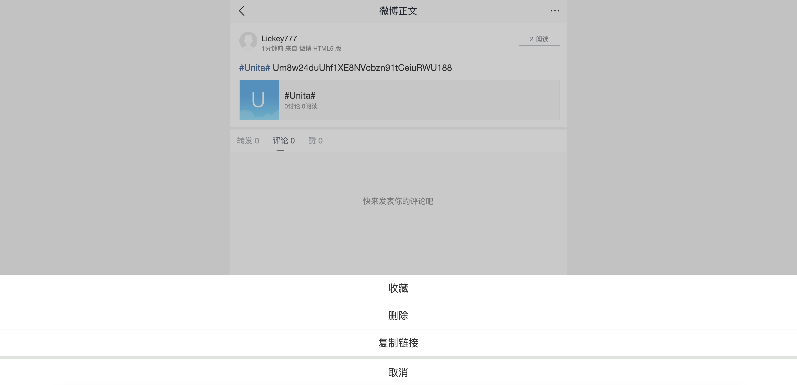

# Unita Quick Start
Unita is the blockchain service provider based on open source project Qtum, provides enterprise application solutions that can be customized in various industries.

Unita is based on consortium blockchain, builds a main chain with many side-chains system architecture, integrate one-click-blockchain, cross-chain transaction, data management and other modules and diversified supporting tools to form a one-stop blockchain enterprise service

We provide various services such as Unita full node wallet, faucet to get airdrop of UNT, blockchain explorer and blockchain stats,etc, to help you to use Unita.

Unita URLs are as follws：

Unita Homepage：https://unita.network/

Unita Qt-wallet download：https://github.com/zsrem/unitaprerelease/releases

Unita One-Click-Blockchain：https://chain.unita.network/

Unita Faucet：https://faucet.unita.network/

Unita Stats：https://stats.unita.network/

## Contents

- [Download](###Download-full-node-wallet)
- [Run Wallet](###run-wallet)
- [Send Transactiom](###send-transaction)
    - [Main Interface](####My-Wallet)
    - [Transaction](####Send)
- [Get UNT through faucet](###Get-Airdrop-through-Faucet)

### Download full node wallet

Find the latest release in [Github](https://github.com/zsrem/unitaprerelease/releases) and download wallet according to your device.

### Run Wallet

Install the full node wallet and run it after downloaded. It will display window as picture below if there is no full node data existed, and then you should choose blockchain data path. You can use the defult path or custom it.

Click 'OK' to enter the main interface of qt wallet. Wallet will connect nodes of Unita main network and download data of Unita blockchain in defult. You can also change chainId in 'Preference'(Mac users) to connect other blockchain network launched in 'One-Click-Blockchian'.(See mor details in '[One-Click-Launch-Chain](https://doc.unita.network/zh/One-Click-Launch-Chain/)')  

### Send Transaction

If you own the privatekey of an Unita address with UNT, you can open Console in Help/Debug Window and input command "importprivkey 'unitaprivkey'" to import your address in wallet.

If not, maybe you should get an Unita address by command "getnewaddress". You can export privatekey by command "dumpprivkey 'unitaaddress'" after you have got a new address.

#### My Wallet

Wallet will display some information such as balances in main interface:
1. Balances
2. Avaliable balance
3. Pending balance
4. Total balance
5. Other Tokens
6. Recent Transaction

#### Send

You can send transaction on the Send menu to realize to send certain number of UNTs to Unita address.

Pay To: Here we’ll enter the address we want to send UNT to (Only Unita ignition addresses will work).

Label: Optional, as it’s stated, it’s just a name/tag.

Amount: Here we enter the amount of UNT we want to send.

Once all fields are covered, we can click on the “Send” button and the UNT coins will be sent to the address we entered above.

### Get Airdrop through Faucet

Enter [Unita Faucet](https://faucet.unita.network/) homepage.

Unita Faucet airdrop UNT by verifying Twitter or Sina Weibo, and process is following:
1. Choose a social network to login
2. Follow the example below to publish content(Twitter content is '#Unita +UnitaAddress', Sina Weibo content is '#Unita# +UnitaAddress')
3. Copy content URL to the form above and click "Get Unita"
4. Watch the in process transaction list below and wait

我们以新浪微博为例实际操作。
在 https://m.weibo.cn/ 中登录微博账号 （https://m.weibo.cn/是微博的Html5版，便于您获取到正确的微博链接）

登录后根据微博内容要求发布对应话题和地址

发布完成后进入到自己的主页找到发布后的那条微博，复制链接

将获取的链接粘贴入水龙头的输入框中，完成验证码验证，等待确认（获得的链接应是 https://m.weibo.cn/detail/${id} 格式）

Twitter 用户操作与微博相同

注意：为了防止 UNT 的恶意过度申领，我们采取了社交媒体加验证码的验证模式，同时限制了申领数量，每次申领成功会获得50枚 UNT，一个社交媒体账号在24小时内只能申领一次，但允许同一个 Unita 地址通过不同的社交账号申领。
