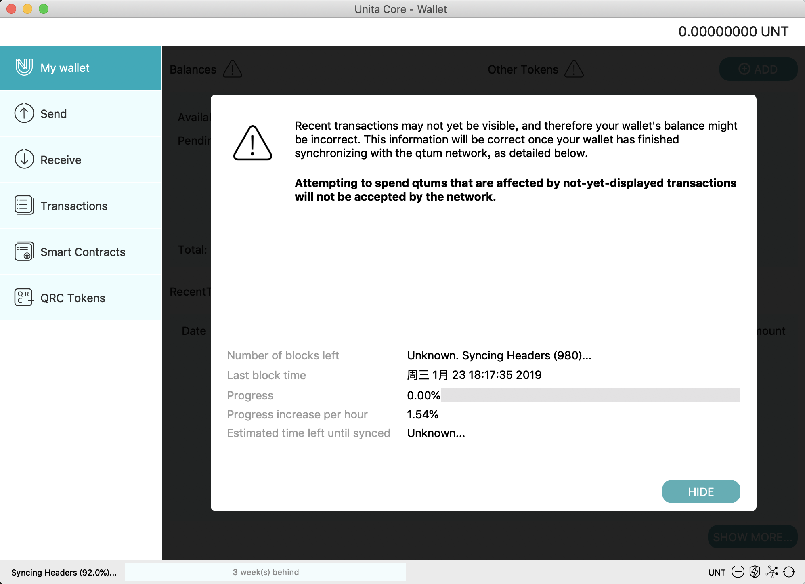
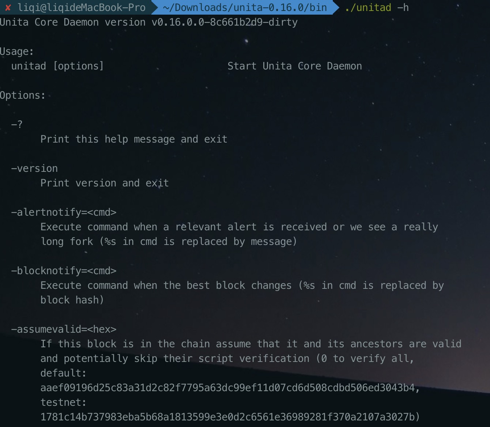
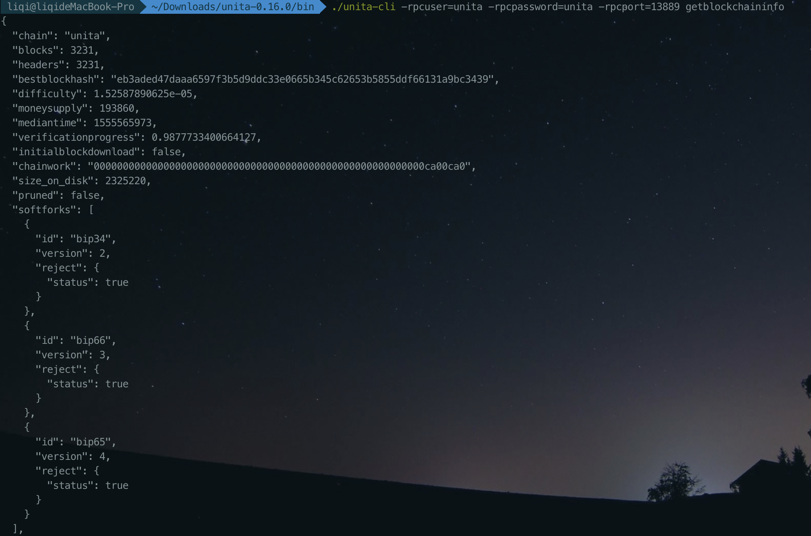
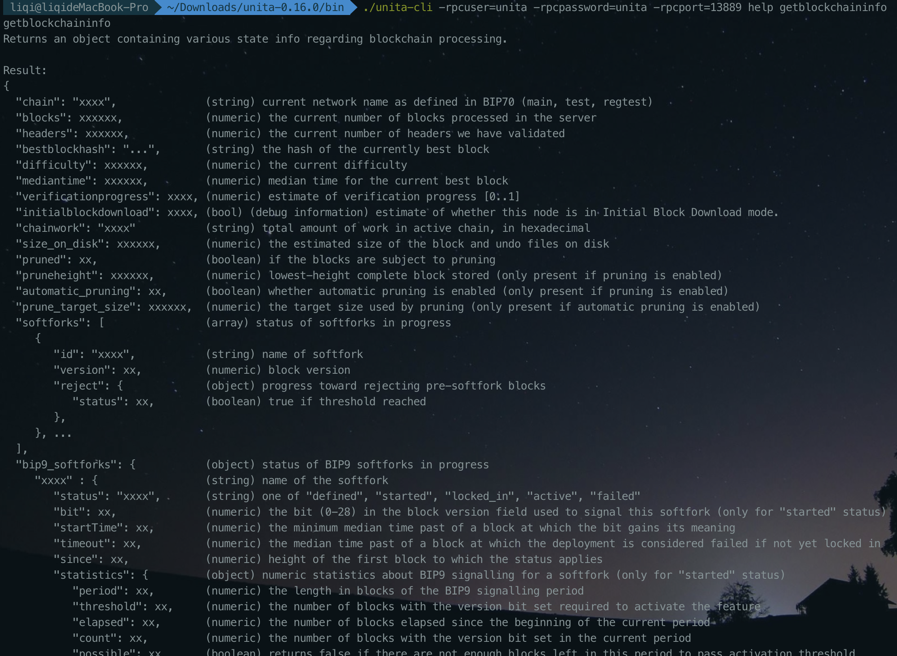
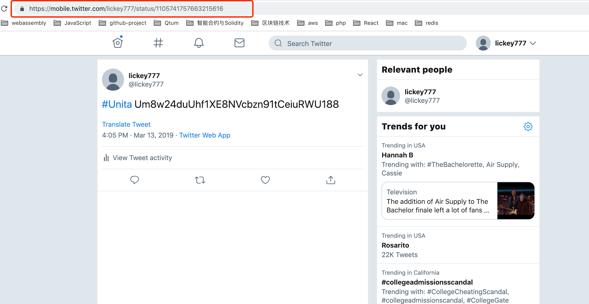
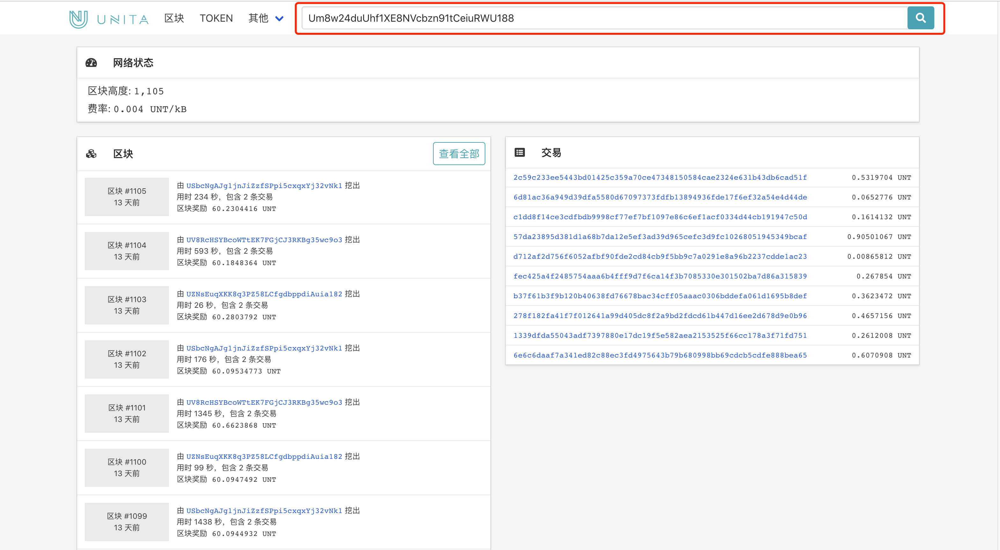
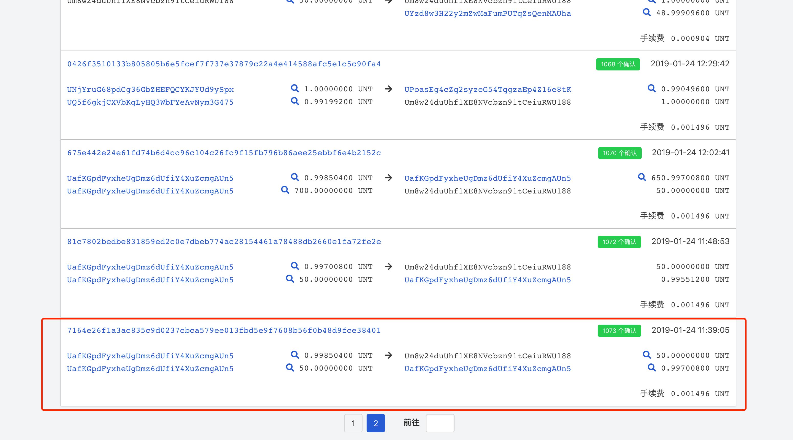
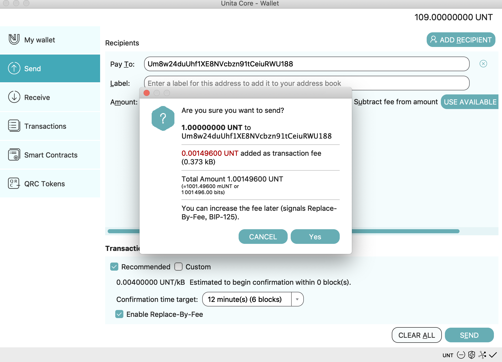

# Unita Quick Start

Unita is the blockchain service platform based on the open source Qtum Project and provides enterprise application solutions that can be customized in various industries.

Unita is a consortium blockchain, builds a main chain with many side-chains for its system architecture, and provides one-click blockchain, cross-chain transaction, data management, and other modules and diversified supporting tools to form a one-stop blockchain enterprise solution.

We provide various applications and services such as the Unita full node wallet, faucet for an airdrop of UNT coins, blockchain explorer and blockchain stats, etc., to help you use Unita.

Unita URLs are as follows：

Toolkits: [Homepage](https://unita.network), [Qt-wallet download](https://github.com/UnitaNetwork/unita/releases), [Stats](https://stats.unita.network), [Explorer](https://explorer.unita.network), [Faucet](https://faucet.unita.network), [One-click Blockchain](https://chain.unita.network).

Document: [English](https://doc.unita.network/en/), [中文](https://doc.unita.network/zh/).

# Contents

- [Unita Quick Start](#unita-quick-start)
- [Contents](#contents)
- [Wallet Installation](#installation)
    - [QT Wallet](#qt-wallet)
        - [Download QT Full Node wallet](#download-qt-full-node-wallet)
        - [Run QT Wallet](#run-qt-wallet)
    - [Commandline Wallet](#commandline-wallet)
        - [Download Commandline Wallet](#download-commandline-wallet)
        - [Run Commandline Wallet](#run-commandline-wallet)
        - [Unita-cli Usage](#unita-cli-ssage)
- [Usage](#usage)
    - [Faucet](#faucet)
    - [Blockchain Explorer](#blockchain-explorer)
    - [Unita Blockchain Stats](#unita-blockchain-stats)
    - [Send Transactions](#send-transactions)

# Installation

## QT Wallet
---
### Download QT Full Node wallet

Find the latest release in [GitHub](https://github.com/UnitaNetwork/unita/releases) and download wallet according to your device.


### Run QT Wallet

Download, install and run the full node wallet. It will display the welcome window below for the initial installation. You can choose the default data directory or a custom data directory(for example, macOS can choose osx-unsigned.dmg)


Click 'OK' to launch the Qt wallet. The wallet will connect nodes of Unita main network and download the Unita blockchain. You can also change the Unita chainId (Mac users: 'Preference', Windows users: Settings - Options) to connect to other Unita blockchains launched with 'One-Click-Blockchain'. (See more details in '[One-Click-Launch-Chain](https://doc.unita.network/zh/One-Click-Launch-Chain/)').



## Commandline Wallet
---

### Download Commandline Wallet
To use the command line wallet, find the latest release in [GitHub](https://github.com/UnitaNetwork/unita/releases) and select the corresponding zip file to download and unzip it(for example, mac can choose osx64.tar.gz).

### Run Commandline Wallet 
Enter the corresponding directory in the command line and start the wallet with unitad command:
```
$ cd unita-0.16.0/bin
$ ./unitad
```
You can use the -h command under unitad to get the option settings you want:


Common settings:
```
-chain=<chainid>  // Blockchain id you want to connect
-daemon  //   Run in the background as a daemon and accept commands
-datadir=<dir>  //  Specify data directory
-rpcuser=<user>  //  username for rpc
-rpcpassword=<pw>  //  password for rpc
```
Other commands and their functions can be obtained with ./unitad -h.

### Unita-cli Usage

Unita-cli is a client that interacts with full node wallet. You can send various requests to the wallet through unita-cli. We use the getblockchaininfo command as an example:
```
$ cd unita-0.16.0/bin
$ ./unitad -daemon -rpcuser=unita -rpcpassword=unita -rpcport=13889
$ ./unita-cli -rpcuser=unita -rpcpassword=unita -rpcport=13889 getblockchaininfo
```
Rpc interface of the full node wallet will return the corresponding result:



All RPC requests and meaning of their return values can be obtained with ./unita-cli help:


# Usage

If you have the private key of a Unita address that holds UNT, you can open Console in Help/Debug Window and use the command "importprivkey 'unitaprivkey'" to import your address to the wallet.


If you don't have a Unita private key, you can get a Unita address with the 'REQUEST PAYMENT' button on the Receive page or by using the command "getnewaddress". You can export a private key by using the command "dumpprivkey 'unitaaddress'" after you have a new address.


The QT wallet will display some information such as balances on the My Wallet page:
1. Balances
2. Available balance
3. Pending balance
4. Total balance
5. Other Tokens
6. Recent Transaction


## Faucet

Enter [Unita Faucet](https://faucet.unita.network/) homepage.


The Unita Faucet airdrops UNT by verifying the request from Twitter or Sina Weibo using the following process:
1. Choose a social network (Twitter or Sina Weibo) and login
2. Follow the example below to publish your UNT address (Twitter format is '#Unita +UnitaAddress', Sina Weibo format is '#Unita# +UnitaAddress')
3. Copy the URL for your message and paste into the "Get Unita" field in the Faucet page
4. The transaction will be confirmed in the next block and you can watch using the Explorer

Let's take Twitter as an example.

Log in your twitter account in https://mobile.twitter.com（https://mobile.twitter.com/ is HTML5 version of Twitter, please use it so that you can get a correct URL for the airdrop）.


Follow the example on the Faucet page to enter the message URL for your Unita address.


Copy URL of the tweet of your Unita address.



Paste the URL into the Faucet page field and click "Get Unita", then use the Explorer to watch the transaction and wait for confirmation in the next block (Correct form of URL is https://mobile.twitter.com/${name}/status/${id}）.

You can get UNT with a Sina Weibo URL in the same way. 

To rate limit the airdrop of UNT from the Faucet, we adopted the verification of social media plus verification code and limited the number of requests. Each successful airdrop request will receive 50 UNTs, and a social media account can only apply once within 24 hours. Meanwhile, we allow the same Unita address to be claimed through different social accounts.

## Blockchain Explorer

After you have received UNT you can watch the status of your Unita addresses and details of transactions on the blockchain using the [Explorer](https://explorer.unita.network/).



Input a Unita address in the search field to see transactions and the balance for that address.



You can also see detailed information about each block, tokens launched, and smart contracts with the Unita Explorer. You can see the balance ranking of UNT addresses and stats of miner addresses, and even send raw transactions using "Send Raw Transaction" in the Explorer.


## Unita Blockchain Stats

You can view stats and status of Unita main network in [Stats page](https://stats.unita.network/), which includes best block height, best block size, TPS (Transactions Per Second) and so on. Status of Supernodes (miners) in the Unita network is also available.


## Send Transactions

You can send UNT using the Send menu selection to send an amount of UNTs to a specific Unita address.


Pay To: Here we’ll enter the address we want to send UNT to (only Unita addresses will work).

Label: Optional, as it’s stated, it’s just a name/tag.

Amount: Here we enter the amount of UNT we want to send.

Once all fields are entered, we can click on the “Send” button and the UNT coins will be sent to the address we entered above.



Transactions for Smart Contracts and QRC Tokens follow the pattern of the Qtum-Qt wallet, so you can check that documentation.

