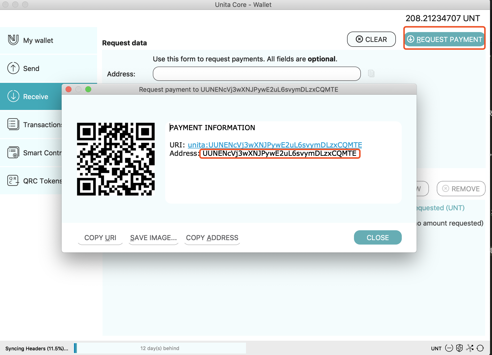
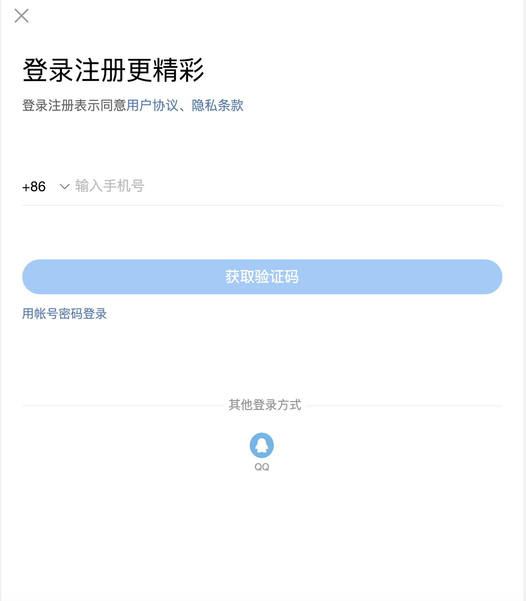
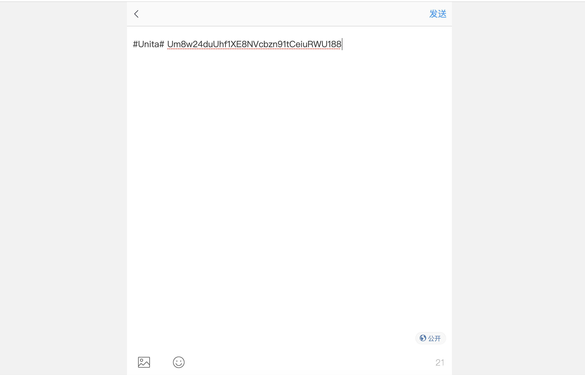
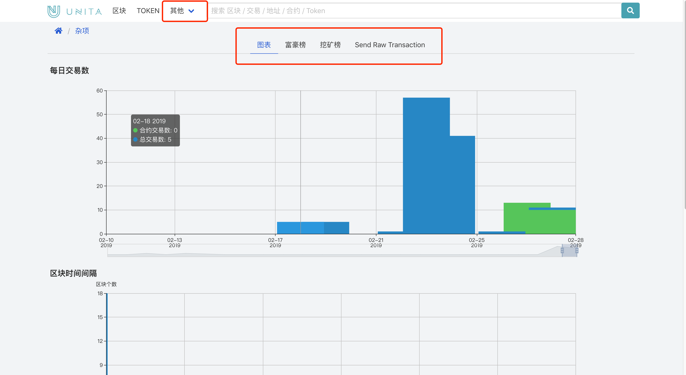

# Unita 快速开始
Unita 是基于开源项目量子链的区块链服务商，提供多个行业可定制化的企业级应用解决方案。

Unita 以联盟链为基础，构建一主链多侧链的系统架构，结合一键发链、跨链交易、数据管理等模块以及多样化配套工具，组成一站式区块链企业服务，具有搭建快速、性能稳定、平台安全的独特优势。

我们提供了 Unita 全节点钱包、水龙头领币、区块浏览器和区块链状态显示等服务，帮助您更好地使用 Unita 。

Unita 相应资源如下：

工具：[主页](https://unita.network)、[钱包下载](https://github.com/zsrem/unitaprerelease/releases)、[网络状态](https://stats.unita.network)、[浏览器](https://explorer.unita.network)、[测试币申领](https://faucet.unita.network)、[一键发链](https://chain.unita.network)。

文档：[English](https://doc.unita.network/en/)、[中文](https://doc.unita.network/zh/)。

## 目录

- [下载](###下载全节点钱包)
- [运行](###运行全节点钱包)
- [使用](###钱包使用)
- [水龙头领币](###水龙头领币)
- [浏览器查看交易](###浏览器)
- [查看实时网络状态](###状态显示)
- [发送交易](###发送交易（Send）)

### 下载全节点钱包

进入[Github下载链接](https://github.com/zsrem/unitaprerelease/releases),找到最新版本的 release ，根据自己的设备选择对应的客户端下载。

### 运行全节点钱包

我们下载完成后安装全节点钱包，安装完毕后打开。没有全节点数据的用户打开后，如下图所示，客户端会让您选择区块链数据路径，您可以使用默认路径也可自定义数据路径。

点击'ok'按钮后进入 qt 钱包的概览界面，也是启动后的默认界面。默认启动时连接 Unita 主网，并会同步主网数据，需要连接一键发链的其他区块链网络也可在'系统偏好设置'（Mac用户）中修改链的名称来实现更改（详情可参见[一键发链教程](https://doc.unita.network/zh/One-Click-Launch-Chain/)）。

### 钱包使用

如果您拥有 Unita 代币 UNT，且拥有对应地址的私钥，您可打开 Help/Debug Window，打开 Console，输入命令 importprivkey "unitaprivkey" 来导入私钥，如下图所示：

如果您没有私钥，则可以通过主页的 Recieve 界面的"REQUEST PAYMENT"按钮获得新地址， 也可以通过 getnewaddress 命令获取新的地址，并通过命令 dumpprivkey "unitaaddress" 来导出私钥

此时，在钱包主页的概览界面会显示您的余额等信息：
1. 余额（Balances）
2. 可用余额（Avaliable）
3. 等待中的余额（Pending）
4. 总额（Total）
5. 其他代币（Other Tokens）
6. 最近交易记录（Recent Transaction）

### 水龙头领币

进入[Unita水龙头](https://faucet.unita.network/)领币界面

Unita 水龙头采用社交媒体 Twitter 和 新浪微博分享的方式申领 UNT 代币，我们首先简述一下分享 Unita 申领代币的流程：
1. 选择您熟悉的社交媒体，登录账号
2. 按照页面上提示的内容样式，发布对应的微博或 Twitter（Twitter 格式为 '#Unita +Unita地址'，微博格式为 '#Unita# +Unita地址'）
3. 将该条分享的 URL 复制，粘贴到输入框中
4. 点击'Get Unita'按钮，等待检测分享内容是否符合要求，等待代币到账

我们以新浪微博为例实际操作。
在 https://m.weibo.cn/ 中登录微博账号 （https://m.weibo.cn/是微博的Html5版，便于您获取到正确的微博链接）

登录后根据微博内容要求发布对应话题和地址

发布完成后进入到自己的主页找到发布后的那条微博，复制链接

将获取的链接粘贴入水龙头的输入框中，完成验证码验证，等待确认（获得的链接应是 https://m.weibo.cn/detail/${id} 格式）

Twitter 用户操作与微博相同

注意：为了防止 UNT 的恶意过度申领，我们采取了社交媒体加验证码的验证模式，同时限制了申领数量，每次申领成功会获得50枚 UNT，一个社交媒体账号在24小时内只能申领一次，但允许同一个 Unita 地址通过不同的社交账号申领。

### 浏览器

从水龙头获取到代币后，您可以在[浏览器界面](https://explorer.unita.network/)查看您的账户状态以及交易信息。

在主页的搜索框中输入您水龙头申领代币的地址，可在该地址对应的搜索结果中找到成功申领代币的交易。

同时您可以在浏览器中查看每个区块的具体信息，查看在智能合约中发行的代币，我们还提供了丰富的图表以供大家查看区块链网络的整体状态，富豪榜和挖矿榜来查看地址余额排名和挖矿地址状态，也可通过"Send Raw Transaction"直接发送交易

### 状态显示

您可以在[状态显示界面](https://stats.unita.network/)查看当前 Unita 主网网络参数与状态，其中包括最新区块高度、区块大小、tps等等信息，也可观察网络中的节点状态

### 发送交易（Send）

在 QT 钱包的 Send 界面可以发送交易实现转账，向指定的 Unita 地址发送指定数量的 UNT

付给（Pay To）：在此处输入想要发送的 Unita 接收地址，请注意只有 Unita 地址有效。

标签（Label）： 可选项，给上面输入的地址打标签。

金额（Amount）： 在此处输入要发送的 Unita 数额。

填写完各项后，点击发送，等待3秒后再次确认，即可将 UNT 发送至目标地址。你也可以点击下方的添加收款人同时发送到多个地址。

